# Implementation Plan: src/gcl/core/commitment.py

## Overview

This document outlines the implementation plan for the core commitment dataclasses in the GCL framework.

## Design Decisions

1. **Pydantic v2** for validation and serialization
2. **String expressions with safe parser** for predicates (no `eval()`)
3. **Function registry** for verification functions (serializable references)
4. **Plain Python lists** for embeddings (convert to tensors when needed)
5. **Immutable models** where appropriate using `frozen=True`
6. **UUID-based IDs** auto-generated

## Class Hierarchy

```mermaid
classDiagram
    class VerificationStatus {
        <<enumeration>>
        PENDING
        SUCCESS
        FAILURE
        TIMEOUT
        ERROR
    }
    
    class Predicate {
        +name: str
        +expression: str
        +description: Optional~str~
        +evaluate context: dict -> bool
    }
    
    class ActionSpec {
        +action_type: str
        +parameters: dict
        +timeout_seconds: Optional~float~
        +description: Optional~str~
    }
    
    class Consequence {
        +consequence_type: str
        +magnitude: float 0.0-1.0
        +description: str
        +metadata: Optional~dict~
    }
    
    class FailureMode {
        +id: str auto-generated
        +name: str
        +condition: Predicate
        +consequence: Consequence
        +severity: float 0.0-1.0
        +remediation: Optional~ActionSpec~
    }
    
    class ContextRegion {
        +description: str
        +embedding: Optional~List~float~~
        +bounds: dict
        +tags: List~str~
    }
    
    class VerificationResult {
        +status: VerificationStatus
        +commitment_id: str
        +triggered_failure_mode: Optional~str~
        +details: dict
        +timestamp: datetime
        +verification_duration_ms: Optional~float~
    }
    
    class GroundedCommitment {
        +id: str auto-generated
        +issuer: str
        +trigger_conditions: List~Predicate~
        +promised_behavior: ActionSpec
        +success_condition: Predicate
        +failure_modes: List~FailureMode~
        +stake: float >= 0
        +confidence: float 0.0-1.0
        +valid_contexts: ContextRegion
        +verification_fn_name: Optional~str~
        +created_at: datetime
        +expires_at: Optional~datetime~
        +metadata: dict
    }
    
    class CommitmentPortfolio {
        +id: str auto-generated
        +owner: str
        +commitments: List~GroundedCommitment~
        +created_at: datetime
        +total_stake: property
        +active_commitments: property
        +add_commitment: method
        +remove_commitment: method
        +validate: method
    }
```



## File Structure

```
src/gcl/
├── __init__.py
└── core/
    ├── __init__.py
    ├── commitment.py      # Main implementation
    ├── predicates.py      # Safe expression parser
    └── registry.py        # Function registry for verification
```

## Implementation Details

### 1. Predicate (predicates.py)

```python
class Predicate(BaseModel):
    """A condition that can be evaluated against a context."""
    
    name: str
    expression: str  # Safe expression string
    description: Optional[str] = None
    
    def evaluate(self, context: dict[str, Any]) -> bool:
        """Evaluate predicate against context using safe parser."""
        return safe_eval(self.expression, context)
```

**Safe Expression Parser Features:**
- Supports comparison operators: `==`, `!=`, `<`, `>`, `<=`, `>=`
- Supports logical operators: `and`, `or`, `not`
- Supports field access: `context.field` or `context['field']`
- Supports basic arithmetic: `+`, `-`, `*`, `/`
- NO function calls, NO imports, NO exec

### 2. ActionSpec (commitment.py)

```python
class ActionSpec(BaseModel):
    """Specification of an action to be performed."""
    
    action_type: str
    parameters: dict[str, Any] = Field(default_factory=dict)
    timeout_seconds: Optional[float] = Field(default=None, ge=0)
    description: Optional[str] = None
```

### 3. Consequence (commitment.py)

```python
class Consequence(BaseModel):
    """The consequence of a failure mode."""
    
    consequence_type: str  # e.g., "stake_slash", "reputation_loss", "escalation"
    magnitude: float = Field(ge=0.0, le=1.0)
    description: str
    metadata: dict[str, Any] = Field(default_factory=dict)
```

### 4. FailureMode (commitment.py)

```python
class FailureMode(BaseModel):
    """A specific way a commitment can fail."""
    
    id: str = Field(default_factory=lambda: str(uuid4()))
    name: str
    condition: Predicate
    consequence: Consequence
    severity: float = Field(ge=0.0, le=1.0)
    remediation: Optional[ActionSpec] = None
    
    model_config = ConfigDict(frozen=True)
```

### 5. ContextRegion (commitment.py)

```python
class ContextRegion(BaseModel):
    """Defines the valid context bounds for a commitment."""
    
    description: str
    embedding: Optional[list[float]] = None
    bounds: dict[str, Any] = Field(default_factory=dict)
    tags: list[str] = Field(default_factory=list)
```

### 6. VerificationResult (commitment.py)

```python
class VerificationStatus(str, Enum):
    PENDING = "pending"
    SUCCESS = "success"
    FAILURE = "failure"
    TIMEOUT = "timeout"
    ERROR = "error"

class VerificationResult(BaseModel):
    """Result of verifying a commitment."""
    
    status: VerificationStatus
    commitment_id: str
    triggered_failure_mode: Optional[str] = None
    details: dict[str, Any] = Field(default_factory=dict)
    timestamp: datetime = Field(default_factory=datetime.utcnow)
    verification_duration_ms: Optional[float] = None
    
    model_config = ConfigDict(frozen=True)
```

### 7. GroundedCommitment (commitment.py)

```python
class GroundedCommitment(BaseModel):
    """A verifiable behavioral contract."""
    
    id: str = Field(default_factory=lambda: str(uuid4()))
    issuer: str
    trigger_conditions: list[Predicate] = Field(min_length=1)
    promised_behavior: ActionSpec
    success_condition: Predicate
    failure_modes: list[FailureMode] = Field(min_length=1)
    stake: float = Field(ge=0.0)
    confidence: float = Field(ge=0.0, le=1.0)
    valid_contexts: ContextRegion
    verification_fn_name: Optional[str] = None  # Registry reference
    created_at: datetime = Field(default_factory=datetime.utcnow)
    expires_at: Optional[datetime] = None
    metadata: dict[str, Any] = Field(default_factory=dict)
    
    @field_validator('failure_modes')
    @classmethod
    def sort_failure_modes_by_severity(cls, v):
        """Ensure failure modes are sorted by severity (descending)."""
        return sorted(v, key=lambda fm: fm.severity, reverse=True)
    
    @model_validator(mode='after')
    def validate_expiration(self):
        """Ensure expires_at is after created_at if set."""
        if self.expires_at and self.expires_at <= self.created_at:
            raise ValueError("expires_at must be after created_at")
        return self
    
    def is_expired(self) -> bool:
        """Check if commitment has expired."""
        if self.expires_at is None:
            return False
        return datetime.utcnow() > self.expires_at
    
    def triggers_match(self, context: dict[str, Any]) -> bool:
        """Check if all trigger conditions are met."""
        return all(pred.evaluate(context) for pred in self.trigger_conditions)
```

### 8. CommitmentPortfolio (commitment.py)

```python
class CommitmentPortfolio(BaseModel):
    """A collection of commitments with validation."""
    
    id: str = Field(default_factory=lambda: str(uuid4()))
    owner: str
    commitments: list[GroundedCommitment] = Field(default_factory=list)
    created_at: datetime = Field(default_factory=datetime.utcnow)
    max_total_stake: Optional[float] = None
    
    @property
    def total_stake(self) -> float:
        """Sum of all commitment stakes."""
        return sum(c.stake for c in self.commitments)
    
    @property
    def active_commitments(self) -> list[GroundedCommitment]:
        """Commitments that haven't expired."""
        return [c for c in self.commitments if not c.is_expired()]
    
    def add_commitment(self, commitment: GroundedCommitment) -> None:
        """Add a commitment with validation."""
        if self.max_total_stake is not None:
            if self.total_stake + commitment.stake > self.max_total_stake:
                raise ValueError(
                    f"Adding commitment would exceed max stake "
                    f"({self.total_stake + commitment.stake} > {self.max_total_stake})"
                )
        self.commitments.append(commitment)
    
    def remove_commitment(self, commitment_id: str) -> bool:
        """Remove a commitment by ID. Returns True if found and removed."""
        for i, c in enumerate(self.commitments):
            if c.id == commitment_id:
                self.commitments.pop(i)
                return True
        return False
    
    def get_commitment(self, commitment_id: str) -> Optional[GroundedCommitment]:
        """Get a commitment by ID."""
        for c in self.commitments:
            if c.id == commitment_id:
                return c
        return None
```

### 9. Function Registry (registry.py)

```python
from typing import Callable, Any

# Type alias for verification functions
VerificationFn = Callable[[dict, dict, dict], 'VerificationResult']

class VerificationRegistry:
    """Registry for verification functions."""
    
    _instance: Optional['VerificationRegistry'] = None
    _functions: dict[str, VerificationFn]
    
    def __new__(cls):
        if cls._instance is None:
            cls._instance = super().__new__(cls)
            cls._instance._functions = {}
        return cls._instance
    
    def register(self, name: str) -> Callable[[VerificationFn], VerificationFn]:
        """Decorator to register a verification function."""
        def decorator(fn: VerificationFn) -> VerificationFn:
            self._functions[name] = fn
            return fn
        return decorator
    
    def get(self, name: str) -> Optional[VerificationFn]:
        """Get a verification function by name."""
        return self._functions.get(name)
    
    def list_functions(self) -> list[str]:
        """List all registered function names."""
        return list(self._functions.keys())

# Global registry instance
verification_registry = VerificationRegistry()
```

## Validation Rules Summary

| Field | Validation |
|-------|------------|
| `stake` | `>= 0.0` |
| `confidence` | `0.0 <= x <= 1.0` |
| `severity` | `0.0 <= x <= 1.0` |
| `magnitude` | `0.0 <= x <= 1.0` |
| `failure_modes` | Non-empty, sorted by severity desc |
| `trigger_conditions` | Non-empty |
| `expires_at` | Must be after `created_at` if set |
| `timeout_seconds` | `>= 0` if set |

## Serialization

All models use Pydantic's built-in JSON serialization:

```python
# Serialize to JSON
commitment_json = commitment.model_dump_json()

# Deserialize from JSON
commitment = GroundedCommitment.model_validate_json(commitment_json)

# Serialize to dict
commitment_dict = commitment.model_dump()

# Deserialize from dict
commitment = GroundedCommitment.model_validate(commitment_dict)
```

## Unit Tests Required

1. **Predicate tests**
   - Safe expression evaluation
   - Invalid expression rejection
   - Context variable access

2. **FailureMode tests**
   - Severity validation
   - Immutability

3. **GroundedCommitment tests**
   - Auto-generated ID
   - Failure mode sorting
   - Expiration validation
   - Trigger matching
   - JSON serialization/deserialization

4. **CommitmentPortfolio tests**
   - Stake calculation
   - Max stake enforcement
   - Add/remove commitments
   - Active commitment filtering

5. **Registry tests**
   - Function registration
   - Function retrieval
   - Singleton behavior

## Next Steps

1. Create project structure with `pyproject.toml`
2. Implement `predicates.py` with safe expression parser
3. Implement `registry.py` with verification function registry
4. Implement `commitment.py` with all dataclasses
5. Write comprehensive unit tests
6. Add `__init__.py` exports
